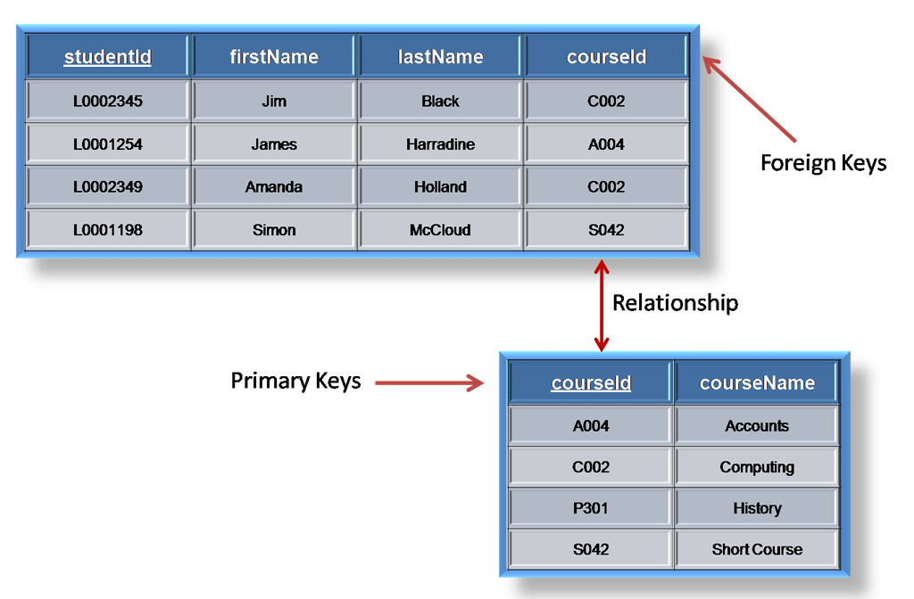
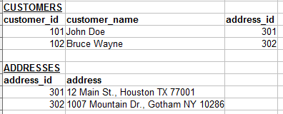
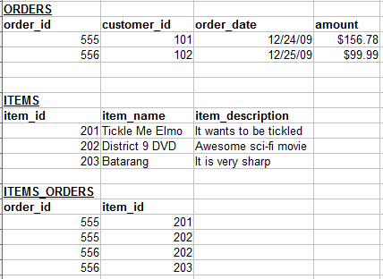
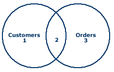

<!--WDI3 3:02 -->

<!--3:00 5 minutes -->

<!--Hook: Wouldn't it be amazing if we could keep all our data nice and organized inside one table?  So much easier.  Well, unfortunately, that's not the way the world works.  The good news is that it is a problem that SQL is especially good at solving.  So here we go... -->

# SQL Relationships and Joins

### Relationships in SQL / SQL JOINs

*By the end of this lesson, developers should be able to:*
- **Define** what a foreign key is
- **Describe** how to represent a one-to-many relationship in SQL database
- **Explain** how to represent one-to-one and many-to-many relationships in a SQL DB
- **Distinguish** between keys, foreign keys, and indexes
- **Describe** the purpose of the JOIN
- **Use** JOIN to combine tables in a SELECT
- **Describe** what it means for a database to be normalized

<!-- 3:04 WDI3 -->
<!--3:05 15 minutes -->

## Vocabulary

### Primary key

A **primary key** is a field in a table which uniquely identifies each row/record in a database table.

### Foreign key

A **foreign key** is a column (or columns) that references a column (most often the primary key) of another table.

In other words:



<!--actually 3:12 -->
## Relationships

**Relationships** are the established associations between two or more tables. Relationships are based on common fields from more than one table, often involving primary and foreign keys.

### One-to-one

Let's say we are running an e-commerce site and we have customers with addresses:


...but we want to separate those addresses into their own table.



These relationships are rare, but can sometimes be useful.  The keywords here are that *a customer* **has one** *address* and *an address* **belongs to** *a customer*.


<!--The only use case I can see for this is that we are doing some sort of big data crunching on our addresses or these addresses get re-used in a LOT (and I mean a LOT of places--like sales people have these addresses and providers have these addresses).-->

### One-to-many

Here's the big one.  What if we want to be able to connect all orders to the customer who made them?  **Spoiler alert: ** you want to do this.  Then we'd want a relationship like this:


This is the most common relationship by far. The keywords here are that *a customer* **has many** *orders* and *an order* **belongs to** *a customer*.


### Many-to-many

What if we want to keep track of the connections between items and orders?  An order can certainly **have many** items, but there's nothing to keep Bob from ordering the item that Kim did, or from Kim ordering it again next week.  Because of that, we'll want a relationship like this:



The keywords here are that *an item* **has and belongs to many** *orders* and *an order* **has and belongs to many** *items*.

Notice that we needed to create an entirely new table for this, one that has a row for every connection between an order and an item.  Also notice that both orders (555 and 556) have two items a piece, and that item 202 is in both orders.

>**Note:** Now I know what you're thinking.  Why don't we just put each item in a column in the order?  Well, how many items can there be in an order?  So do we need 8?  16?  Sometimes only 4?  This is the beauty of a table like the one above.  It keeps us organized, and keeps us from filling our tables with empty space.


<!--Catch-phrase with primary key, foreign key, one-to-many, many-to-many -->

<!--3:20 5 minutes -->

<!--Actually 3:32 WDI2 and WDI3-->

### Normalization

Database **normalization** is the process of organizing the columns (attributes) and tables (relations) of a relational database to reduce data redundancy and improve data integrity.

In other words, a well **normalized** database does not store the same information twice, and takes the fewest jumps possible to get the information we need.  This requires a well-thought-out use of the relationships listed above.

<!--half-mast for rest -->

<!--3:25 WDI3 -->
<!--3:25 10 minutes -->

## JOIN Queries

In order to get information from multiple tables (relations), we need to use a JOIN query.

First, let us set up our tables.  We will open up `psql` and run the following:

```
CREATE DATABASE advanced_sql;

\c advanced_sql;

CREATE TABLE customers (
    customer_id INT PRIMARY KEY,
    customer_name VARCHAR(100)
);
 
CREATE TABLE orders (
    order_id INT PRIMARY KEY,
    customer_id INT,
    amount DECIMAL,
    FOREIGN KEY (customer_id) REFERENCES customers(customer_id)
);
 
INSERT INTO customers (customer_id, customer_name) VALUES
(1, 'Bobby'),
(2, 'Billy'),
(3, 'Jacy'),
(4, 'Jess');
 
INSERT INTO orders (order_id, customer_id, amount) VALUES
(1, 1, 19.99),
(2, 1, 35.99),
(3, 3, 17.99),
(4, 4, 12.99);
```

<!--3:34 WDI3 -->
<!--3:35 10 minutes -->

### Inner JOIN

If we are looking to find the intersection of our order and customer tables (i.e. all orders placed by each customer), we would use an Inner JOIN which is written like this:

`SELECT * FROM customers JOIN orders ON (customers.customer_id = orders.customer_id);`

This query is represented by #2 below:



### Left Outer JOIN

If we still want to see results even if there is no match from the second table (orders), we would use a Left JOIN, which is written like this:

`SELECT * FROM customers LEFT OUTER JOIN orders ON (customers.customer_id = orders.customer_id);`

This query is represented by #1 above.

### Right Outer JOIN

If we still want to see results even if there is no match from the first table (customers), we would use a Right JOIN, which is written like this:

`SELECT * FROM customers RIGHT OUTER JOIN orders ON (customers.customer_id = orders.customer_id);`

Hm...looks the same as the inner JOIN, right?  That's because there are no orders without a customer.  However, there are some customers with no orders.  And as my friend Geoff says when he turns left on red, "Right and left are all relative".  Let's flip the venn diagram, and we'll see something different.

`SELECT * FROM orders RIGHT OUTER JOIN customers ON (customers.customer_id = orders.customer_id);`

This query is represented by #3 above.

<!--3:46 WDI3 -->
<!--Run through first couple library_sql basic (non JOIN) and advanced (JOIN) exercises -->

## Resources

- [More on SQL relationships](https://code.tutsplus.com/articles/sql-for-beginners-part-3-database-relationships--net-8561)
- [Even more on SQL relationships](https://msdn.microsoft.com/en-us/library/bb243835(v=office.12).aspx)
